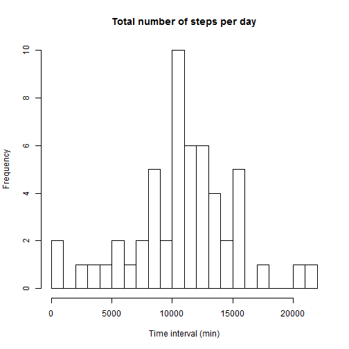
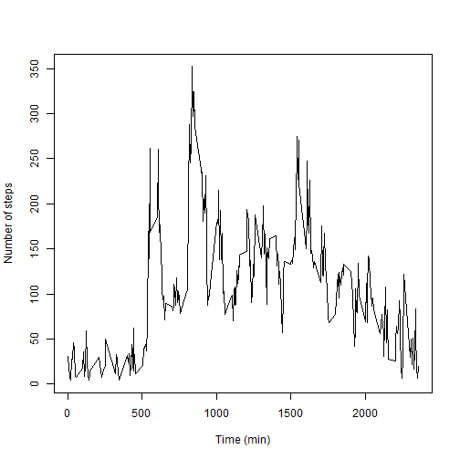
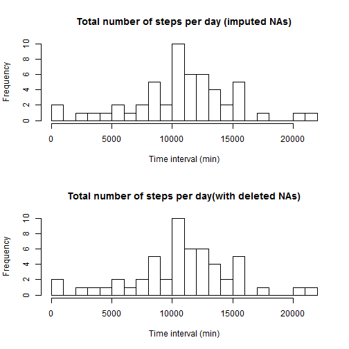
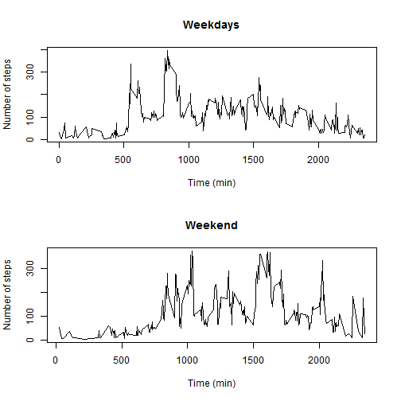

setwd("C:/Users/pedro/projetos_R/reproducible_research//repdata-data-activity")

Peer Assignment 1 - Reproducible Research Course
=================

----
**Loading and processing the data into a format** 
**suitable for analysis**
  
The data is read with `read.csv`, cached in memory and transformed in a `tbl_df` (see `dyplr` vignettes).

```r
library(knitr)
library(dplyr)

activity_df <- tbl_df(read.csv("activity.csv"))
# Discarding the "0 steps" values
non_zero_activity <- filter(activity_df,steps != 0)
```

----
**Histogram of the total number of steps per day.**
  
This code chunk uses the chain method of `dplyr` via the `%>%` operator in order to calculate the total number of steps per day and plots the histogram of the obtained values. The function `hist` of the base package `graphics` was used binning the data in 20 levels.
  

```r
steps_df <- activity_df %>%
        group_by(date) %>%
        summarise(n_steps = sum(steps,na.rm = T))
steps_df <- filter(steps_df,n_steps != 0)
hist(as.integer(steps_df$n_steps),breaks=20, main = "Total number of steps per day", 
     xlab = "Time interval (min)", ylab = "Frequency")
```

 

----
**Calculation of the mean and median of the total number of steps per day**
  
The `dplyr` function `summarise` was used to obtain the mean and median.

```r
mean_steps_df <- non_zero_activity %>%
        group_by(date) %>%
        summarise(mean_steps = mean(steps,na.rm = T))

median_steps_df <- non_zero_activity %>%
        group_by(date) %>%
        summarise(median_steps = median(steps,na.rm = T))
results_by_day <- merge(mean_steps_df,median_steps_df,by="date")
names(results_by_day) <- c("date","mean_steps","median_steps")
print(results_by_day)
```

```
##          date mean_steps median_steps
## 1  2012-10-02   63.00000         63.0
## 2  2012-10-03  140.14815         61.0
## 3  2012-10-04  121.16000         56.5
## 4  2012-10-05  154.58140         66.0
## 5  2012-10-06  145.47170         67.0
## 6  2012-10-07  101.99074         52.5
## 7  2012-10-09  134.85263         48.0
## 8  2012-10-10   95.19231         56.5
## 9  2012-10-11  137.38667         35.0
## 10 2012-10-12  156.59459         46.0
## 11 2012-10-13  119.48077         45.5
## 12 2012-10-14  160.61702         60.5
## 13 2012-10-15  131.67532         54.0
## 14 2012-10-16  157.12500         64.0
## 15 2012-10-17  152.86364         61.5
## 16 2012-10-18  152.36364         52.5
## 17 2012-10-19  127.19355         74.0
## 18 2012-10-20  125.24096         49.0
## 19 2012-10-21   96.93407         48.0
## 20 2012-10-22  154.71264         52.0
## 21 2012-10-23  101.34091         56.0
## 22 2012-10-24  104.43750         51.5
## 23 2012-10-25   56.63636         35.0
## 24 2012-10-26   77.02273         36.5
## 25 2012-10-27  134.92000         72.0
## 26 2012-10-28  110.17308         61.0
## 27 2012-10-29   80.93548         54.5
## 28 2012-10-30  110.32584         40.0
## 29 2012-10-31  179.23256         83.5
## 30 2012-11-02  143.24324         55.5
## 31 2012-11-03  117.45556         59.0
## 32 2012-11-05  141.06757         66.0
## 33 2012-11-06  100.40964         52.0
## 34 2012-11-07  135.61053         58.0
## 35 2012-11-08   61.90385         42.5
## 36 2012-11-11  132.71579         55.0
## 37 2012-11-12  156.01449         42.0
## 38 2012-11-13   90.56790         57.0
## 39 2012-11-15   20.50000         20.5
## 40 2012-11-16   89.19672         43.0
## 41 2012-11-17  183.83333         65.5
## 42 2012-11-18  162.47312         80.0
## 43 2012-11-19  117.88000         34.0
## 44 2012-11-20   95.14894         58.0
## 45 2012-11-21  188.04412         55.0
## 46 2012-11-22  177.62609         65.0
## 47 2012-11-23  252.30952        113.0
## 48 2012-11-24  176.56098         65.5
## 49 2012-11-25  140.88095         84.0
## 50 2012-11-26  128.29885         53.0
## 51 2012-11-27  158.67442         57.0
## 52 2012-11-28  212.14583         70.0
## 53 2012-11-29  110.10938         44.5
```

---
**Calculation of the average daily activity pattern**
  
Here, the number of steps per interval averaged by date is calculated. Intervals that returned zero in the original data, were discarded. The result is plotted as a time series graph.

```r
t_series <- activity_df %>%
        filter(steps != 0) %>%
        group_by(interval) %>%
        summarise(mean(steps,na.rm = T))
names(t_series) <- c("interval", "steps")
plot(t_series$interval,t_series$steps,type = "l",xlab="Time (min)",ylab = "Number of steps") 
```

 

The interval in wich the number of steps is maximal is 835 with 352.48 steps:

```r
filter(t_series, steps == max(steps))
```

```
## Source: local data frame [1 x 2]
## 
##   interval    steps
## 1      835 352.4839
```

---
**Imputing missing values**
  
The NA values that are interspersed among the `steps` values in the original dataset were replaced with the 
average number of steps of the corresponding day. To accomplish this, the `data.table` package was used.
  
First, the number of NAs is calculated (2304 was the obtained value). 
  
See calculation below:

```r
na_df <-activity_df %>%
        filter(is.na(steps)==T) 

print(nrow(na_df))
```

```
## [1] 2304
```

Original data (activity_df) and the data frame with the daily average of steps (mean_steps_df) are transformed to a `data.table`. 


```r
library(data.table)

activity_dt <- data.table(activity_df,key="date")
mean_steps_dt <- data.table(mean_steps_df,key="date")
```

The main step goes here, in which steps with NAs are replaced with the day average:

```r
imputed_data <- mean_steps_dt[activity_dt][,steps := ifelse(is.na(steps),mean_steps,steps)]
```
There are days that were not used in the measurements (are filled with NAs). These are discarded:

```r
imputed_data <- imputed_data[complete.cases(imputed_data)]
```

Zero values are discarded:

```r
non_zero_imputed <- filter(imputed_data,steps != 0)
```
The column wih average values is also discarded:

```r
non_zero_imputed <- non_zero_imputed[,mean_steps := NULL]
```
Mean, median and total number of steps are calculated and a histogram is plotted:

```r
mean_imputed <- non_zero_imputed[,mean(steps),by=date]

median_imputed <- non_zero_imputed[,median(steps),by=date]

n_steps_imputed <- non_zero_imputed[,sum(steps),by=date]

par(mfrow = c(2,1))
hist(as.integer(n_steps_imputed$V1),breaks=20, main = "Total number of steps per day (imputed NAs)", 
     xlab = "Time interval (min)", ylab = "Frequency")
hist(as.integer(steps_df$n_steps),breaks=20, main = "Total number of steps per day(with deleted NAs)", 
     xlab = "Time interval (min)", ylab = "Frequency")
```

 
  
The values do not differ significantly from the values of the first part of the assignement (in which NAs were discarded). This can be ascertained if one compares with the two histograms.
  
  
---
**Studiyng the effect of the weekday on the displayed activity**
  
To investigate if the pattern of activity was different in weekdays or during the weekend, the following code was run.
  
First, the function `weekdays` was used to create a vector of weekdays corresponding to the cleaned data set(`non_zero_imputed`).

```r
weekday_vec <- weekdays(as.Date(non_zero_imputed$date))
```
A factor variable was created (`test_week`) splitting the data in `weekend` and `weekday`. The resulting vector was pasted to the data by the `dplyr` function `mutate`.

```r
test_week <- ifelse(weekday_vec %in% c("sábado", "domingo"), "weekend", "weekday")
non_zero_imputed <- mutate(non_zero_imputed,test_week)
```
Two time series are created (`t_series_weekday` and `t_series_weekend`) and two time series plots are displayed. Together, the data suggest that at the weekends there is more activity in the 1500-2000 steps range.

```r
t_series_week <- non_zero_imputed %>%
        group_by(test_week,interval) %>%
        summarise(mean(steps))
t_series_weekend <- t_series_week[test_week == "weekend"]
setnames(t_series_weekend,c("test_week","interval","mean(steps)"),c("test_week","interval", "mean_steps"))
t_series_weekday <- t_series_week[test_week == "weekday"]
setnames(t_series_weekday,c("test_week","interval","mean(steps)"),c("test_week","interval", "mean_steps"))

par(mfrow = c(2,1))
plot(t_series_weekday$interval,t_series_weekday$mean_steps,type = "l",main = "Weekdays",
     xlab="Time (min)",ylab = "Number of steps")

plot(t_series_weekend$interval,t_series_weekend$mean_steps,type = "l",main = "Weekend",
     xlab="Time (min)",ylab = "Number of steps")
```

 
  
Together, the data suggest that at the weekends there is more activity in the 1500-2000 steps range.
  
---
